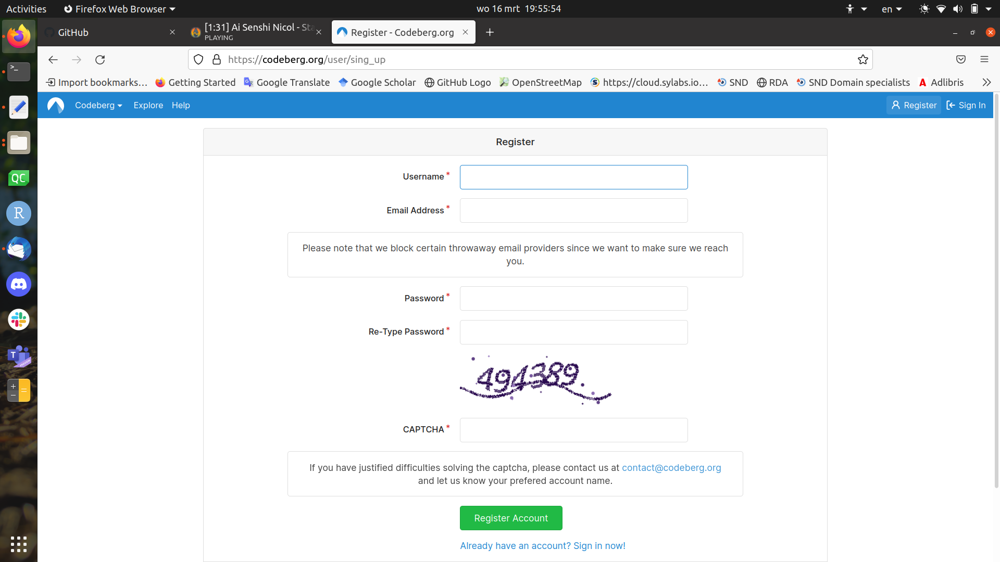
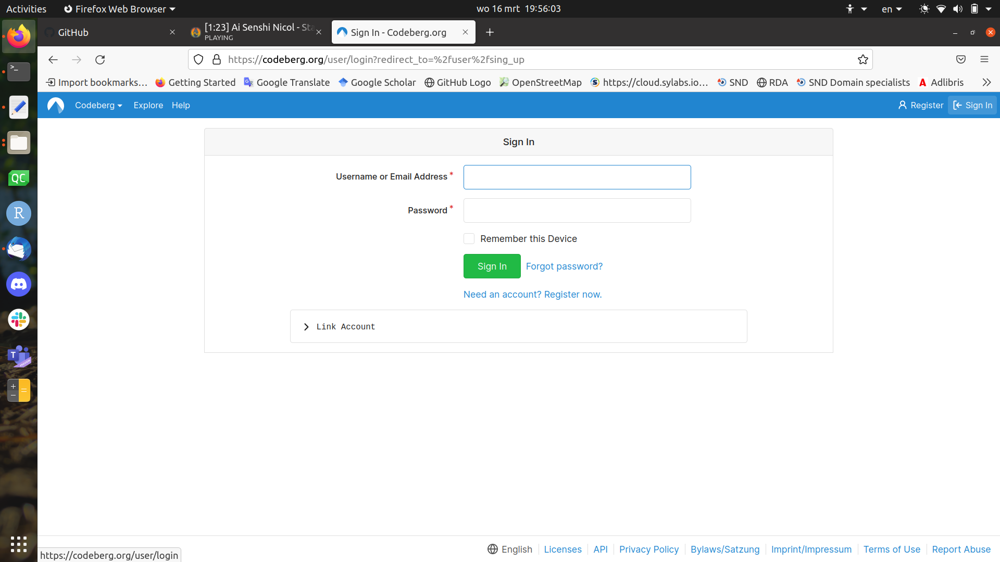
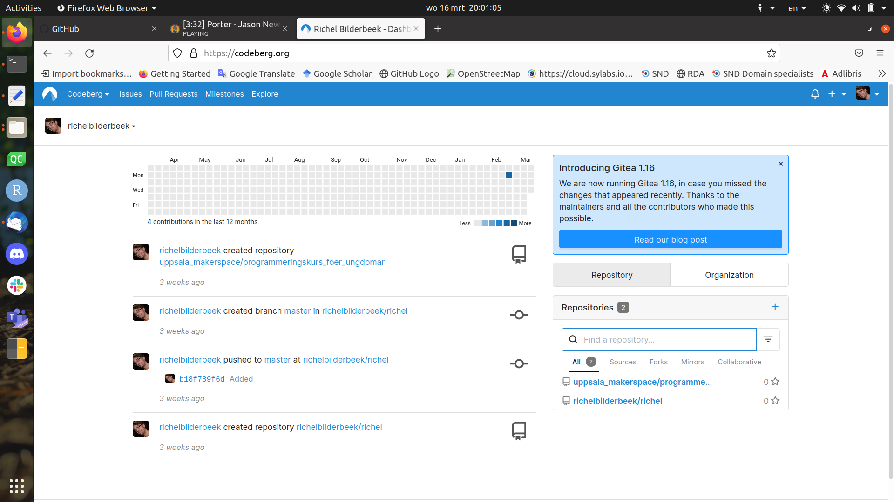
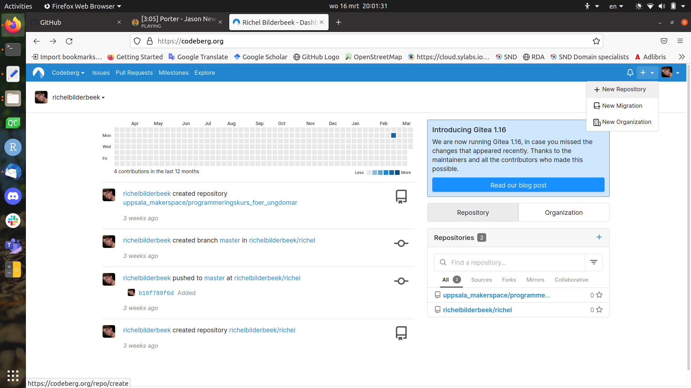
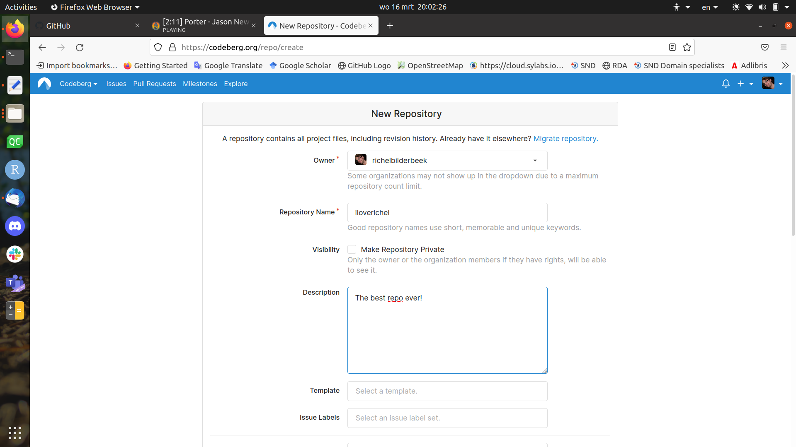
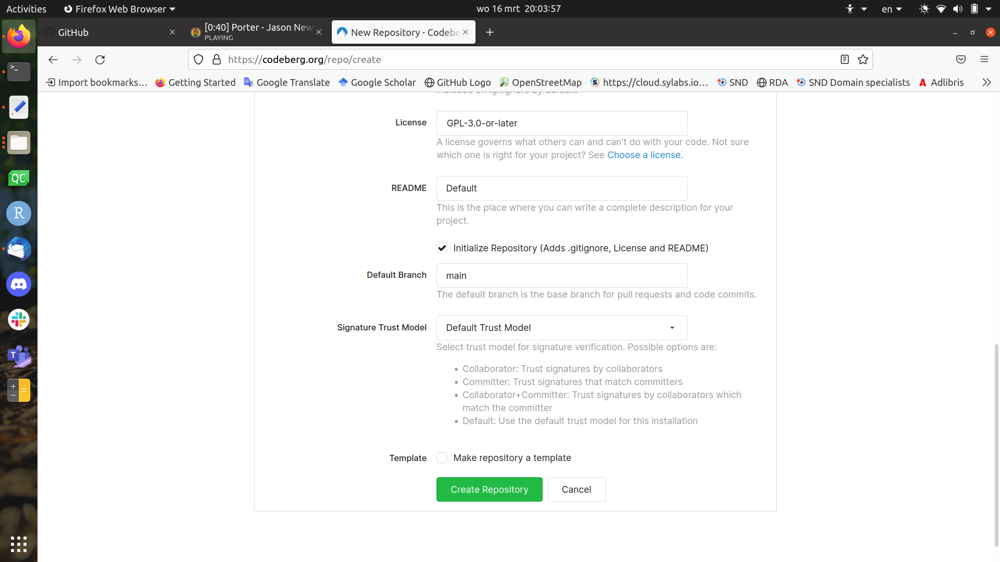
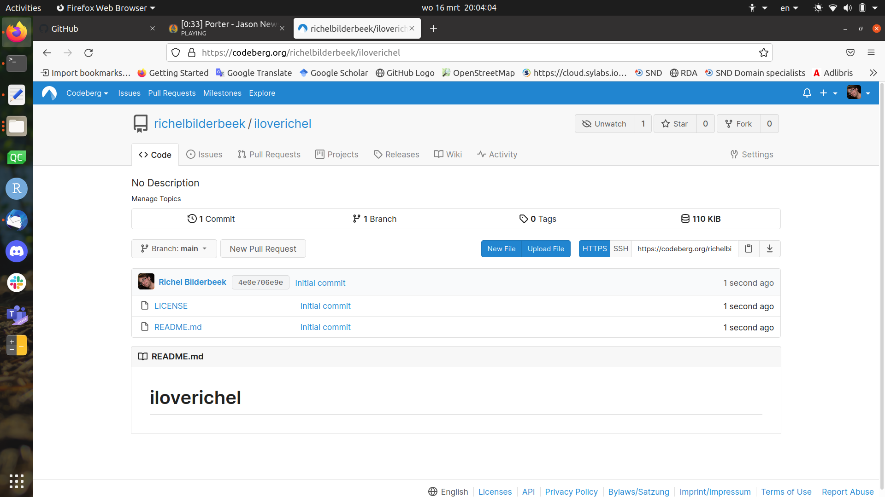

# git_for_youngsters

Exercises to learn git and Codeberg for 8-18 year olds

## Register

Go to [https://codeberg.org/](https://codeberg.org/) and click on 'Register'
to register:

Do so.

## Sign in

Go to [https://codeberg.org/](https://codeberg.org/) and click on 'Register'
to sign in:

Do so, you will be taken to the Dashboard.

## Dashboard

Here you can do many things,
for example create a new repository

## Create a new repository from the dashboard

On the dashboard, click 'New repository':

This will take you to the 'New repository' screen

## 'New repository' dialog

Fill in some things:

Now you have your new repo!

